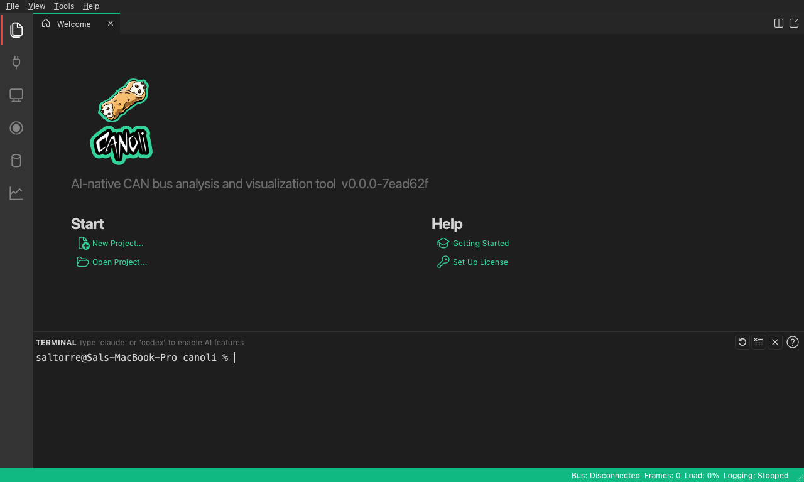
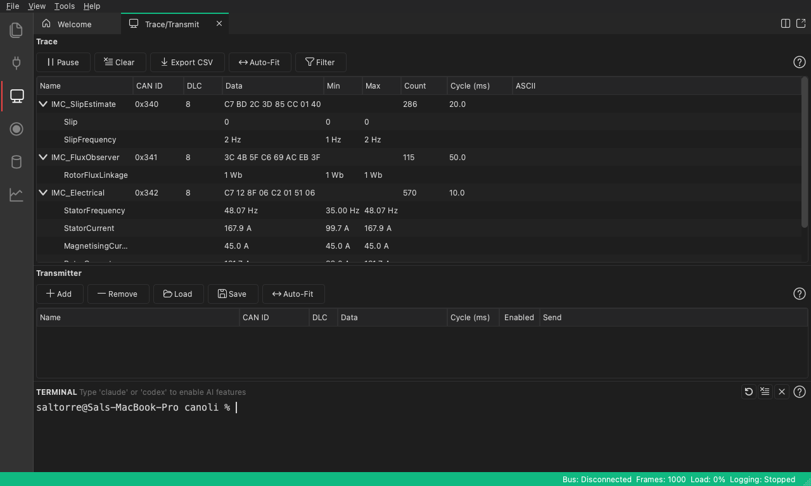
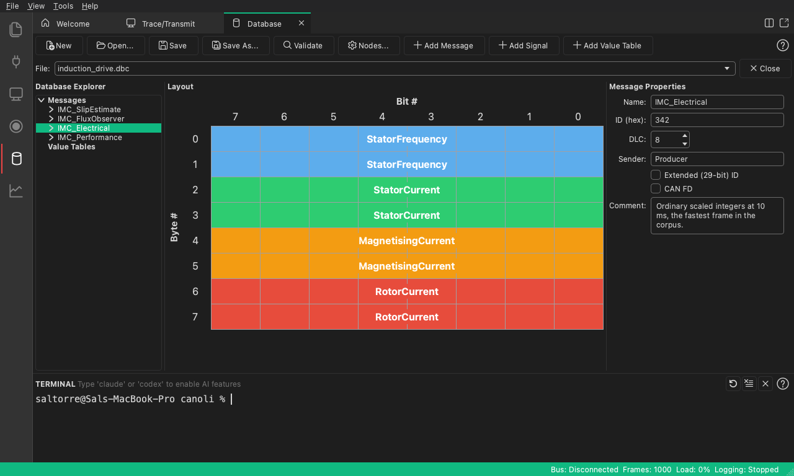
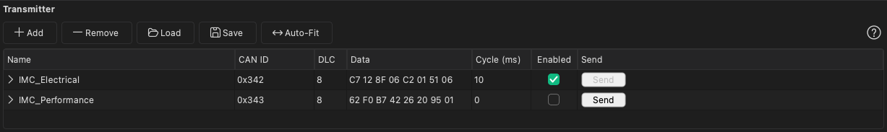
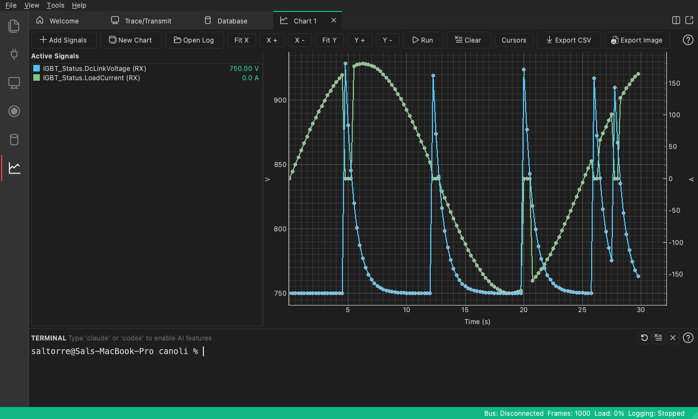
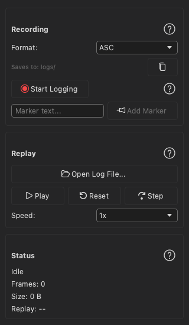

# CANoli

**AI-native CAN bus analyzer** — the bridge between your CAN bus and your AI agent.

Stop searching through CAN logs in a spreadsheet, or pasting them into an AI
chatbot. CANoli connects your agent straight to the bus and lets it run the app
for you: reading traffic, searching the log, and building charts from the real
data.

CANoli embeds no AI model. You bring your own agent, which connects over the
Model Context Protocol and drives the app.

[**Download**](../../releases) · [Product page](https://salvatorre.com/products/canoli) · [Documentation](https://salvatorre.com/products/canoli/docs)



---

## Let your AI do the log work

We have all worked a CAN log one of these ways: scrolling and filtering in a
spreadsheet, running search after search for the one frame that matters, or
pasting the whole capture into a chatbot.

CANoli changes that. Your agent gets direct access to the live bus and your
real databases, so it does the work: decoding unknown IDs, searching the log,
flagging anomalies, and building charts from the actual data.

---

## Everything you need to work with CAN, in one app

### Live trace

Watch incoming traffic grouped by ID, decoded through your own database, with
frame counts, cycle times and bus load at a glance.



### Database editor

Build and edit `.dbc` and `.sym` databases, then watch raw bytes turn into
named signals. **The editor is free forever.**



### Transmit

Send one-shot or periodic frames by signal name rather than by byte — including
sine, square, triangle and sawtooth waveforms, or a custom table you define.



### Chart signals

Plot decoded signals over time, with an axis per unit so a 396 V rail and a
6000 rpm motor share a plot and you can still read both.



### Log and replay

Record a session and play it back later to reproduce and study behaviour.
Reads and writes ASC, BLF and CSV, and reads PCAN TRC.



---

## Downloads

Every build is signed. Take the file for your platform from the
[Releases](../../releases) page.

| Platform | File | Signing |
| --- | --- | --- |
| macOS (Apple silicon) | `CANoli-<version>-macos-arm64.dmg` | Signed and notarized |
| Windows (x64) | `CANoli-<version>-windows-x64-setup.exe` | Authenticode signed |
| Linux (x86_64) | `canoli_<version>_amd64.deb` or `CANoli-<version>-linux-x86_64.tar.gz` | GPG signed |
| Linux (arm64) | `canoli_<version>_arm64.deb` or `CANoli-<version>-linux-aarch64.tar.gz` | GPG signed |

### Which Linux file

Take the **`.deb`** on Debian, Ubuntu, Mint and other Debian-family
distributions, and install it with `apt` rather than `dpkg -i` so the graphics
libraries CANoli needs are resolved:

```bash
sudo apt install ./canoli_<version>_amd64.deb
```

Take the **`.tar.gz`** on anything else, unpack it, and run the `canoli` binary
inside.

**The two architectures need different minimum systems**, because the Qt
packages CANoli is built on publish no ARM build for an older glibc:

| Architecture | glibc | Oldest supported |
| --- | --- | --- |
| `x86_64` | 2.35 | Ubuntu 22.04, Debian 12, Mint 21 |
| `aarch64` | 2.39 | Ubuntu 24.04, Debian 13 |

Check yours with `ldd --version` and `uname -m`. There is more detail, and the
list of distributions that do **not** qualify, in
[System Requirements](https://salvatorre.com/products/canoli/docs/system-requirements).

---

## Verifying a download

Linux has no OS-level signing, so authenticity comes from a detached GPG
signature over each file plus a signed checksum list. Every release carries a
`.sig` beside each file and a `SHA256SUMS-<arch>` with its `.asc`.

With the published CANoli public key:

```bash
gpg --import canoli-public.asc
gpg --verify CANoli-<version>-linux-<arch>.tar.gz.sig CANoli-<version>-linux-<arch>.tar.gz
gpg --verify SHA256SUMS-<arch>.asc SHA256SUMS-<arch>
sha256sum -c --ignore-missing SHA256SUMS-<arch>
```

macOS and Windows builds carry their platform's own signatures, so Gatekeeper
and SmartScreen verify them for you.

---

## Hardware, and the driver it needs

**CANoli does not ship CAN drivers.** Installing CANoli is not enough to see an
adapter — the vendor's driver has to be there first, or the adapter simply does
not appear in the Connection panel and CANoli cannot tell you why.

| Adapter | Windows | macOS | Linux | Driver you need |
| --- | :---: | :---: | :---: | --- |
| PEAK PCAN-USB / USB FD / USB Pro FD | ✅ | ✅ | ✅ | See below |
| Vector VN16xx (VN1610, VN1611, …) | ✅ | — | — | Vector **XL Driver Library** — Windows only, which is why the adapter is |
| SocketCAN (`can0`, `vcan0`, …) | — | — | ✅ | In-kernel, but the interface must be brought up first — see below |
| Virtual (built in) | ✅ | ✅ | ✅ | **None.** Simulates two CAN nodes in software |

### PEAK PCAN

- **Windows** — install the PCAN device-driver package from
  [peak-system.com](https://www.peak-system.com/).
- **macOS** — install the **PCBUSB** library from
  [github.com/mac-can/PCBUSB](https://github.com/mac-can/PCBUSB). This is the
  macOS PCAN driver and is not shipped by PEAK.
- **Linux** — nothing to install in most cases. The kernel's `peak_usb` driver
  ships with most modern kernels and presents the adapter as a **SocketCAN**
  interface, so follow the SocketCAN note below rather than looking for a PCAN
  entry.

### SocketCAN on Linux

CAN adapters are network interfaces here, so the interface has to be up
**before** you connect in CANoli, and **CANoli does not set its bitrate** — the
`ip link` value governs the bus:

```bash
sudo ip link set can0 up type can bitrate 500000
```

### No adapter?

The built-in **Virtual** adapter needs no driver and no hardware. It simulates
two CAN nodes in software, so every feature works — which is the honest way to
evaluate the tool before buying anything.

There is more in
[Connect a CAN Adapter](https://salvatorre.com/products/canoli/docs/connect-adapter).

---

This repository contains release artifacts only — no source code. Please report
issues here.

## Acknowledgments

This repository was made with ❤️ by [Sal Torre](https://github.com/saltorre) for
[Salvatorre, LLC](https://www.salvatorre.com/).
